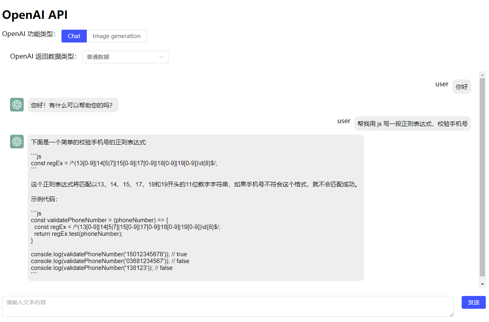
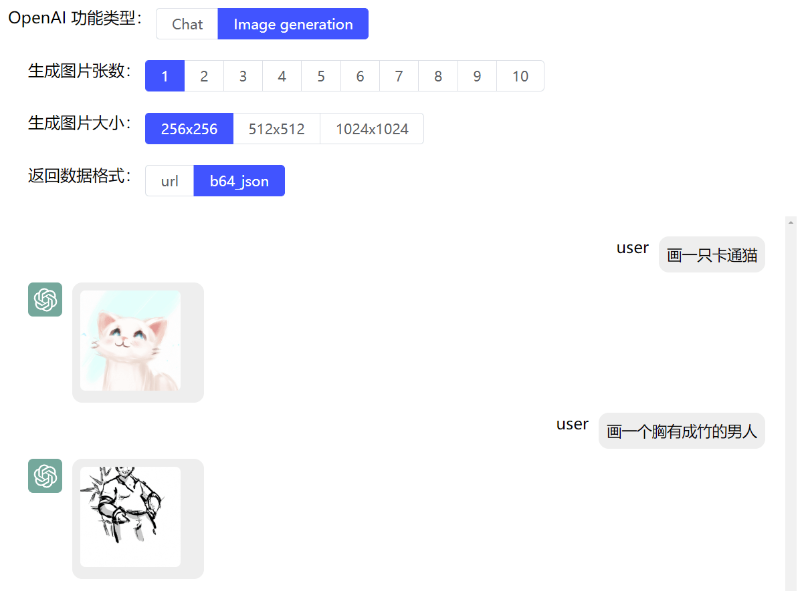
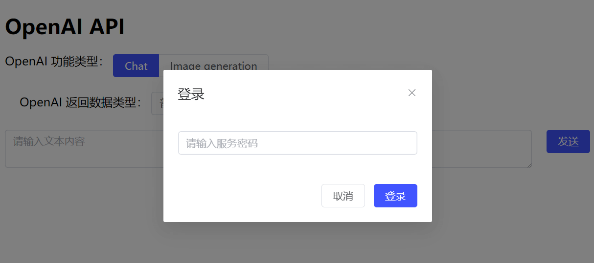

# OpenAI 接口功能体验, 实现 chatpgt、生成图像

OpenAI ChatGPT server

## 代码部署运行

将代码拷贝到服务器（或者 fork 后，git clone 到服务器）

1、在 config/api-key.mjs 文件中将 apiKey 修改为您自己的。

2、修改默认登录密码，由于 OpenAI API 超过 $18 免费额度后会收费，所以设置了登录密码，默认为 123456，可以在 server/args.json 文件中修改默认密码

运行项目

```bash
# 进入项目目录
cd chatgpt-node-vue3 
# 安装依赖
npm install
# 使用 node 或 pm2 开启服务
node server/index.js
```

运行服务成功后，访问 <https://服务器ip:9000> 即可体验功能。**注意服务器需要在国外！！！**，比如 AWS 免费一年国外服务器。

## 功能演示

### chatgpt



### 图片生成



### 登录


